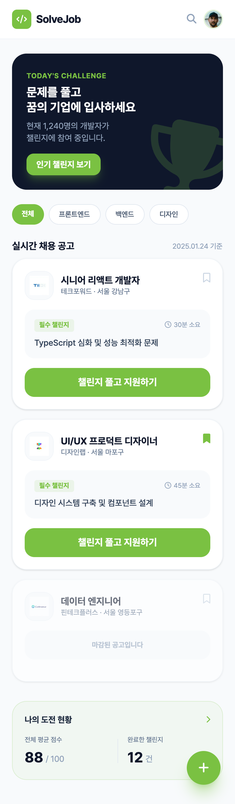
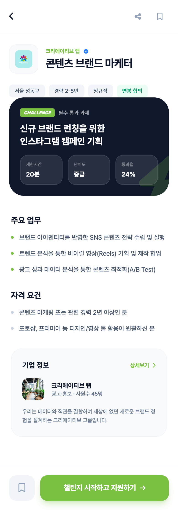

# WorkFit

**WorkFit**은 기업이 제시한 문제와 평가 기준을 바탕으로 AI가 자동으로 채용 과제를 생성하고, 지원자는 이력서 없이 과제 해결만으로 합·불합격을 판단받을 수 있는 **문제 해결 중심 채용 플랫폼**입니다.

---

## 서비스 한 줄 요약

• 기업: 채용 과제 생성·평가 자동화로 **채용 비용·시간 절감**
• 구직자: 스펙 없이 **실력으로만 평가**받는 공정한 지원 경험

---

## 기획 배경

기존 채용 프로세스는 다음과 같은 한계를 가지고 있습니다.
• 이력서·스펙 중심 평가로 실무 역량 판단의 어려움
• 과제 설계 및 평가에 드는 기업의 높은 리소스 비용
• 지원자는 합격 여부와 무관하게 역량을 증명할 기회 부족

WorkFit은 **"문제를 잘 푸는 사람"** 이라는 본질적인 기준으로 채용을 재정의합니다.

---

## 핵심 기능

### 1️⃣ AI 기반 채용 과제 생성

기업이 아래 정보만 입력하면 AI가 과제를 자동 생성합니다.
• 직무명
• 실무 상황 설명
• 원하는 역량 키워드
• 평가 기준(논리력, 정확성, 창의성 등)

→ AI가 **직무 맞춤 문제 + 제한 시간 + 난이도**를 포함한 과제를 생성

---

### 2️⃣ 과제 기반 지원 프로세스

• 이력서 / 자기소개서 ❌
• 포트폴리오 ❌
• 과제 해결 ⭕

지원자는 문제를 풀고 제출하는 것만으로 지원 완료

---

### 3️⃣ AI 자동 평가 및 합·불 판정

• 기업이 입력한 평가 항목을 기준으로 AI 채점
• 점수화된 결과와 합격 / 불합격 자동 분류
• 기업은 결과만 확인 후 다음 단계 진행

---

### 4️⃣ 실시간 채용 공고 & 챌린지

• 직무별 챌린지 리스트 제공
• 소요 시간 / 난이도 / 통과율 표시
• 지원자는 자신의 강점에 맞는 과제 선택 가능

---

## 주요 화면

### 홈 화면

• 오늘의 추천 챌린지 노출
• 직무 카테고리 필터 (프론트엔드 / 백엔드 / 디자인 등)
• 실시간 채용 공고 리스트
• 나의 평균 점수 및 완료 챌린지 현황 제공
{width=20}

### 상세 페이지

• 기업 정보 및 직무 설명
• 필수 통과 과제 안내
• 제한 시간 / 난이도 / 통과율 제공
• 과제 시작 및 지원 버튼
{width=200}

---

## 기대 효과

### 기업 입장

• 과제 설계 및 평가 자동화
• 지원자 실무 역량 빠른 검증
• 채용 프로세스 간소화
• 블라인드 채용 실현

### 구직자 입장

• 스펙 부담 없는 공정한 평가
• 실력 기반 채용 기회 확대
• 문제 해결 경험을 통한 자기 역량 증명

---

## 서비스 컨셉 키워드

• Skill-based Hiring
• Challenge-driven Recruitment
• Resume-less Application
• AI-powered Assessment

---

## 향후 확장 계획

• 직무별 문제 템플릿 고도화
• 기업 맞춤 평가 모델 커스터마이징
• 지원자 피드백 리포트 제공
• 합격자 데이터 기반 추천 채용

---

## 팀 정보

• 프로젝트명: WorkFit
• 목적: 실력 중심 채용 문화 확산

---

> "이력서 대신 문제를 제출하세요."

WorkFit은 **문제를 푸는 순간, 채용이 시작되는 서비스**입니다.
